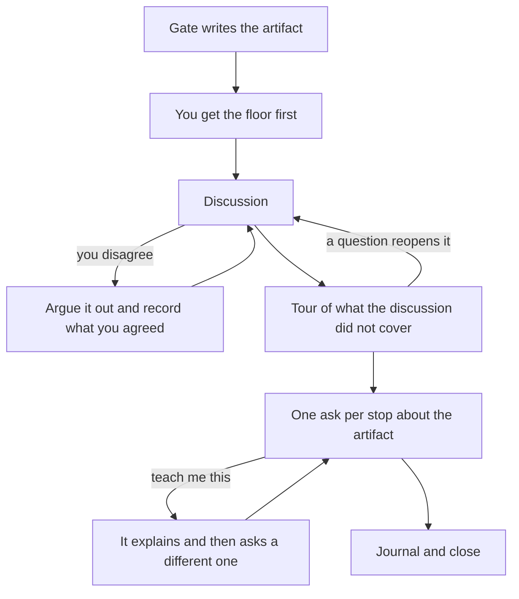

# yaait

**Yet Another AI Thing** — a software development methodology for building things with an
LLM without generating debt nobody can pay.

Six gates, one problem:

> Code accepted without being understood is the fastest debt generator ever built, and it
> compounds. The bill arrives as the tenth change costing ten times the first.

And one mechanism: a gate that fails when you cannot say what the code you just accepted
does — or a record saying you could not.

- **[MANIFESTO.md](MANIFESTO.md)** — what yaait claims, in one page.
- **[COMPARISON.md](COMPARISON.md)** — how it differs from Waterfall, Agile, Scrum and
  spec-driven development, and the evidence for the claims.
- **[METHODOLOGY.md](METHODOLOGY.md)** — the six gates, and the rules that govern them.

## The short version

**The problem:** an unattended LLM is a technical-debt reactor. Code is accepted faster than
anyone can understand it, and every unread change makes the next one harder to read. Measured
across hundreds of millions of commits, borrowing has accelerated an order of magnitude while
servicing has collapsed — the numbers and sources are in [COMPARISON.md](COMPARISON.md).

**Why no existing method catches it:** design used to be expensive, so Waterfall bought it up
front and committed to it. Then rework got cheap, so Agile stopped buying design and let
structure emerge. Now design, code
*and* rework are all cheap — and **only understanding is still expensive.** yaait is built
around the one scarce input.

The specific thing that broke: writing code used to be how you came to understand it.
Authorship implied comprehension, by construction, and every Agile practice quietly depended
on it — emergent design, "the code is the documentation", collective ownership by osmosis.
That link is severed. yaait restores comprehension by other means, because writing no longer
does it.

## The commands

| Command | What it does |
|---|---|
| `/yaait:spec` | Discuss the thing to build (the **TTB**). Every requirement tagged `[stated]`, `[selected]` (chosen from options the gate offered), `[inferred]` or `[assumed]`, so invented requirements are visible. Forces non-goals, falsifiable acceptance criteria, and the bets the spec is making. |
| `/yaait:design` | The blueprint, before the code. Components, invariants, what the design **forbids**, mermaid diagrams — where **every abstraction must justify itself** by naming the second concrete variant that needs it, re-checked by a subagent that has not seen the conversation. Optional; `spec` recommends it against stated criteria. |
| `/yaait:tech` | The stack, with every version **verified** against current docs rather than recalled, plus a falsifier and an exit cost per choice. Optional, and invocable at any point. |
| `/yaait:code` | One increment at a time, with tests. Enforces the hardest rule: **defend the code you are about to modify, before you modify it.** |
| `/yaait:stest` | System test traced clause by clause against the spec. **You observe the critical path yourself**, and the report must say what was *not* tested. |
| `/yaait:debt` | Reads the accumulated receipts in `TECH_DEBT.md` and answers what an increment cannot: which debt is actually costing money, which is dormant and should be closed, and which has recurred often enough to have become a *product* problem needing a roadmap item. Triggered from `:code` and `:stest`, and invocable directly for the questions managers ask. |

Plus one **instrument**, which is not a gate:

| Command | What it does |
|---|---|
| `/yaait:feedback` | Captures what went wrong *in the gate that just ran* — friction, contradictions, questions you had no way of answering, ground covered twice, where you were annoyed — into an append-only `.yaait/FEEDBACK.md` for later forensic analysis. Asks you first and records your words verbatim before offering any account of its own, because the gate that just ran is the party under audit. It captures; it does not diagnose. Provisional, and it says so. |

Nothing is mandatory except honesty about which gates you skipped.

## What it feels like

**You review it before it reviews you.** When a gate finishes an artifact it hands you the
floor first — questions, comments, "this is wrong and here is why" — and only then walks you
through the parts your review did not reach. That order is the method. In the run this was
designed from, the reviewer found a hole in the structure diagrams that every stop the model
had picked walked straight past; an author does not ask questions about what they failed to
draw. The handover catches what the author cannot see. The tour catches what the reviewer
cannot see. Neither one substitutes for the other.



**The tour is not a lecture, and the asks are not an exam.** Each stop is three things: what
this part does, why this shape and not the obvious alternative, and one question — *"I think
that is the most fragile line here. Do you agree, and what would you do about it?"* You are
being asked for a reviewer's judgment about the artifact, not for a fact you are supposed to
have memorised. That form is just as hard to bluff as an interrogation and puts the design on
trial instead of you. Interrupt any stop and it goes back to arguing.

**It argues with you.** Not always — only when it can name the failure mode, who it hurts and
what it costs. If it cannot fill in all three, it agrees in one sentence and moves on. When
your argument changes the outcome it says so and writes down what it had wrong. A discussion
ends in an agreement, not in a winner: what gets recorded is the disputed point, both
positions and what you settled on, never who prevailed.

**Asking to be taught is a real answer, not a way out.** Every stop offers you the concepts it
leaned on, by name: *Answer in my own words* / *Explain &lt;concept&gt;* / *Show me where this
bites* / *Record as debt and move on*. Clicking "Explain RAII" costs nothing; typing "I don't
know what RAII is" is a confession, and the button exists precisely to remove that tax. It
explains against *your* artifact rather than in general, then asks you something else about the
same idea — and logs `TAUGHT`, which is filed apart from debt on purpose, because a method that
records learning as a deficiency teaches people to stop asking. That list of names is also a
disclosure: it is exactly the jargon you are about to approve.

**And when you would rather not, that is fine.** Declining costs nothing but a `DEBT` entry
naming what went undefended. A gate that blocks gets routed around, and then there is no record
at all.

Everything that happens in the round lands in `JOURNAL.md`:

| What you did | What gets written |
|---|---|
| Engaged with an ask | `APPROVAL` |
| Commented, objected, or proposed something else | `CHALLENGE` — both positions and what was agreed; `DECISION` if the artifact changed |
| Asked to have a concept explained | `TAUGHT` |
| Got it wrong | The correction, then `DEBT` — never an approval |
| Passed | `DEBT` naming exactly what is undefended |

## What it produces

In your project, not in this plugin:

```
<project root>/
├── TECH_DEBT.md          outstanding structural debt, with dated evidence of what it has cost
├── EXPERIMENTS.md        decisions settled by measurement, labelled `measured` or `predicted`
├── DESIGN_GUIDELINE.md   optional: standing structural decisions
├── CODING_GUIDELINE.md   optional: standing house style
└── .yaait/
    ├── SPEC.md           the TTB: kind (greenfield/maintenance), requirements with
    │                     provenance, non-goals, acceptance criteria
    ├── DESIGN.md         optional: components, invariants, diagrams
    ├── TECH.md           optional: the stack, verified versions, falsifiers, exit paths
    └── JOURNAL.md        append-only: DECISION, APPROVAL, DEBT, TAUGHT, CHALLENGE
```

The root files sit there because a team reads them on their own account. `TECH_DEBT.md` holds
*structural* debt — a live balance, paid and removed — and every item carries **evidence of
what it has actually cost**, dated, rather than an estimate of what it might. An estimate is
arguable; a list of receipts is not. Every item also records whether it is **contained** behind
a boundary or **spread** across N call sites, which predicts whether it will ever be repaid
better than any cost estimate does.

`DEBT` and `CHALLENGE` are the entries that make the journal worth keeping. Anyone can log
decisions. Logging what you did not understand — and the arguments the LLM lost — is what
makes the record honest enough to be useful in six months.

`/yaait:spec` also installs a short block of yaait's operating rules in your project's
`CLAUDE.md`, so later
sessions honour the reconcile rule and know not to let `SPEC.md` rot even when no yaait
command is invoked.

## Install

```bash
claude plugin marketplace add dgutson/yaait
claude plugin install yaait@yaait-marketplace
```

Or from a local clone:

```bash
claude plugin marketplace add /path/to/yaait
claude plugin install yaait@yaait-marketplace
```

### Run `design` on the strongest model you have

```bash
claude --model claude-opus-5      # and the highest effort level available
```

A design defect is not one fix. `code` traces every increment back to `DESIGN.md`, so a wrong
decomposition costs a reconcile per increment that inherits it — which is the expense yaait exists
to avoid, arriving through the gate meant to prevent it.

**The model measurably changes what the gate produces.** One project, one prompt, one plugin
commit, model as the only variable, five of `design`'s own rules checked mechanically:
`claude-sonnet-5` at high effort obeyed **none** of them and emitted one renderable diagram of
three; `claude-opus-5` obeyed two, and a later run at 0.17.0 obeyed all five with three of three
diagrams. n is small and the runs were headless — see `ROADMAP.md` R-022 — but nothing in the
evidence points the other way.

**Effort level is a recommendation, not a finding.** No run has varied it: the Sonnet run above was
already at high effort. Raise it because a design is the cheapest place to spend compute, not
because this has been measured.

The other gates are not exempt, they are just unmeasured. `design` is where it has been looked at,
and where a defect is worth the most.

## Technical debt is first-class

Ward Cunningham meant something specific by "technical debt": deliberate borrowing, understood
at the time, taken on to ship, with intent to repay. What the phrase degraded into is a label
for code that is merely bad — unpriced, unrecorded, and therefore not a debt at all but a loss
someone will discover later.

yaait takes the original literally. For a compromise to count as debt rather than damage it
must be **chosen**, **written down**, and **contained**:

> Put the deliberate shortcut behind a boundary — one function, one class, one module — so it
> does not leak into everything that touches it and so paying it off later is bounded to that
> one implementation. A litter box works because the mess has an edge, not because the cat
> improved. Debt smeared across forty call sites has no edge, so its repayment cost is
> unbounded, which is a longer way of saying it will never be repaid.

None of this is a craft argument, it is a business one. The cost never presents as "bad
code." It presents as
deceleration, then as defects reaching customers because nobody knew what the change would
break, then as estimates that mean nothing — and at the end as technical bankruptcy, where
servicing costs more than the team can produce and the only moves left are rewrite or
abandon. Elegance is not the goal anywhere in this method. The goal is that **the tenth
change costs roughly what the first one did.**

## When not to use it

Throwaway scripts, spikes, notebooks, code with a known deletion date. A methodology that
claims to apply everywhere is selling something — see the last section of
[COMPARISON.md](COMPARISON.md).

Use it for code that will be maintained, extended, or blamed.

## Status

Early, and **unmeasured**: every number in `COMPARISON.md` is about the problem, none about
the method. yaait has not been run at scale, so its cost per increment is unknown — see
[METHODOLOGY.md](METHODOLOGY.md) §1. `skills/code/references/review.md` is explicitly
**provisional** pending a discussion of Clean Code — see `ROADMAP.md`.

## License

MIT
