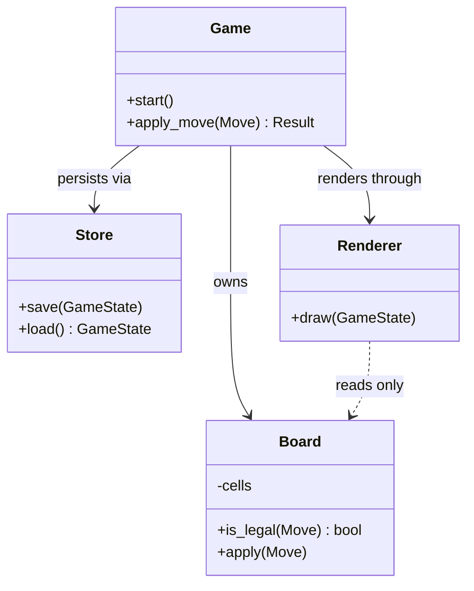
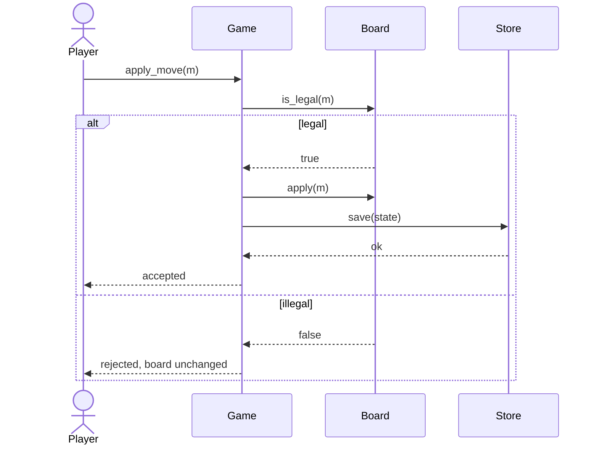
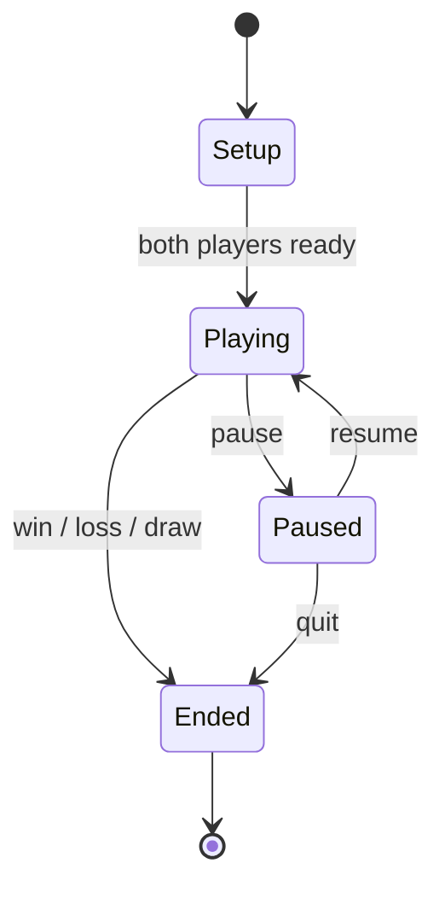
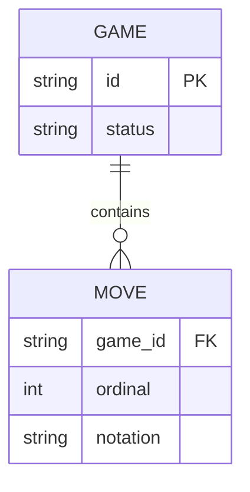

# Diagrams in yaait

Mermaid, not PlantUML. The reason is operational rather than aesthetic: mermaid renders
natively in GitHub, in Claude Code artifacts, in most editors and in every markdown preview,
with no jar, no server, no Graphviz and no toolchain. PlantUML is more expressive and it is
not worth a dependency the reader has to install before they can see the design.

If the user prefers PlantUML, use it — the conventions below all transfer.

## What to produce

**Always:** a class diagram, plus a sequence diagram for the single most important flow.

**When the condition holds:** a state diagram whenever anything has modes, phases or a
lifecycle — even when it feels too obvious to draw. Most defects live in state transitions,
and specifically in the transitions nobody drew. The diagram is where a missing transition
is visible as a gap instead of arriving later as a bug.

**Never:** a diagram per component. Three diagrams a reader studies beat nine they scroll
past, and the point of the diagram is to be read.

## Conventions

- **Direction of dependency is the point of a class diagram.** Get the arrows right; a
  diagram with the right boxes and vague arrows says nothing.
- **Label every relationship.** An unlabelled line between two boxes is a decoration.
  `Board --> Store : persists via` carries the design; `Board --> Store` does not.
- **Show only what the design decides.** Getters, setters, trivial constructors and fields
  the reader can infer all cost attention and add nothing.
- **Name the invariant near the diagram, not in it.** Mermaid notes get unreadable fast;
  `DESIGN.md` has an invariants section for this.
- **Keep diagrams and prose consistent.** If they disagree, a reader believes the diagram.
  When the design changes, the diagram changes in the same edit.

## Class diagram

Note what that last line encodes: `..>` for a read-only dependency, matching a `DESIGN.md`
prohibition that the renderer never mutates state. A diagram that can express a rule is
doing work.

## Sequence diagram

Draw the flow the spec's primary requirement describes. Include the failure branch — the
happy path is rarely where the design is wrong.

The `else` branch is where the invariant "a rejected move leaves the board unchanged"
becomes checkable. Without it the diagram documents only the case that was going to work.

## State diagram

Two checks worth running on every state diagram, because they catch most of what these
diagrams are for:

1. **Every state must be reachable and leavable.** A state with no way out is a hang; a
   state with no way in is dead code.
2. **For every pair of states, ask what happens on the transition you did not draw.** What
   does `pause` do while `Ended`? What does a move arriving during `Setup` do? Those
   undrawn combinations are where the defects are, and the answer is either "impossible,
   and here is what makes it impossible" or a missing transition.

That second check is the highest-value thing in this file. Run it explicitly rather than by
eye.

## Entity / data diagrams

For a persisted format or schema, an ER diagram earns its place, because a persisted format
has a compatibility future and is among the most expensive things in a design to change:

## Checking that it renders

Malformed mermaid fails as a code block full of text, which is worse than no diagram
because it looks like an error in the design rather than in the syntax. Common causes:
unquoted labels containing `:` or `(`, a stray blank line inside the block, participant
names with spaces, and `-->` used where the diagram type wants `->>`.

If a diagram is non-trivial, render it once before finishing — Claude Code artifacts render
mermaid natively, so publishing the design as an artifact is a cheap check as well as a
readable deliverable.
