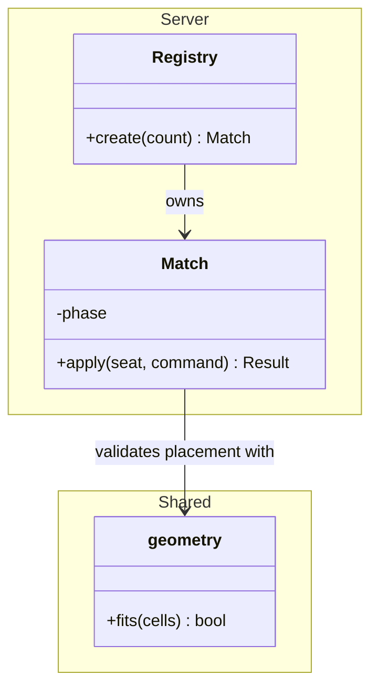
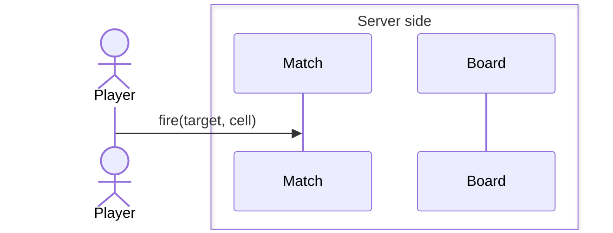
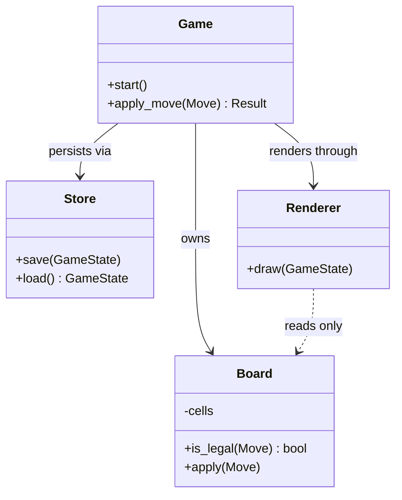
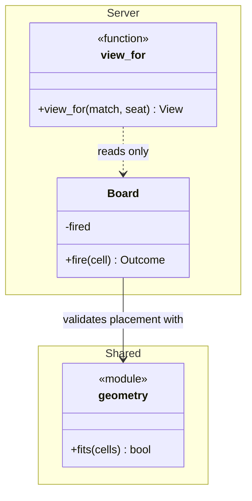
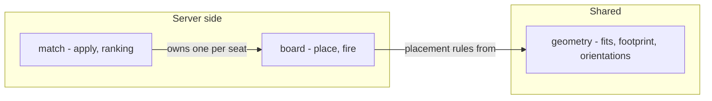
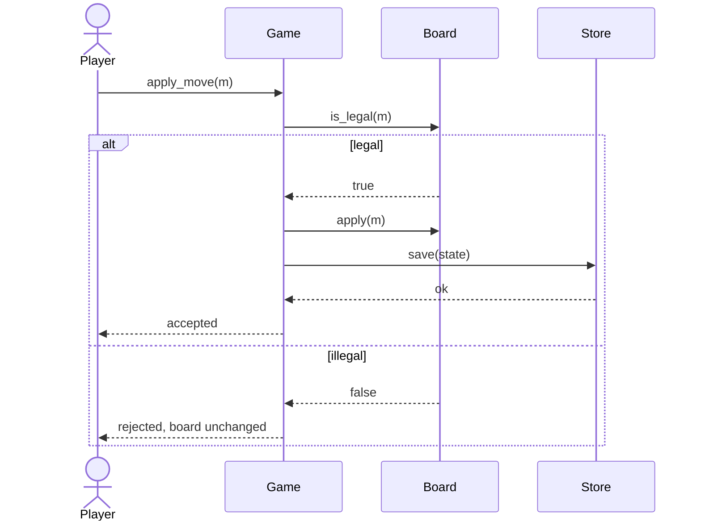
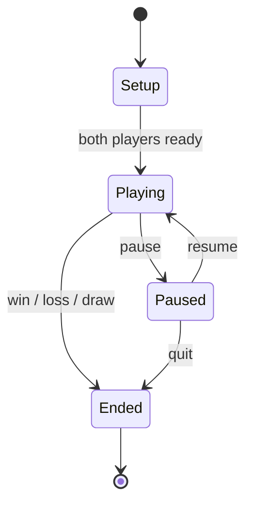
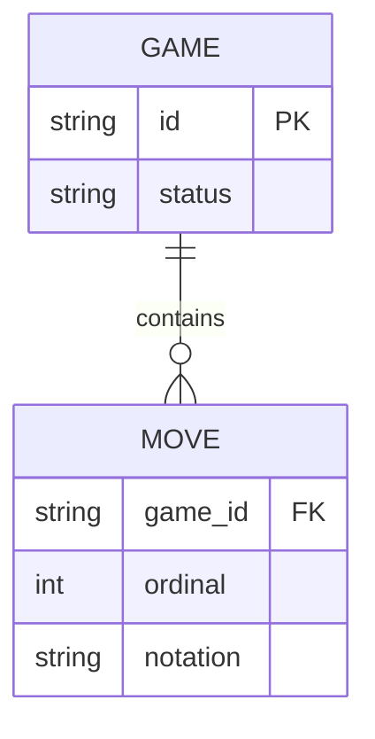

# Diagrams in yaait

Mermaid, not PlantUML. The reason is operational rather than aesthetic: mermaid renders
natively in GitHub, in Claude Code artifacts, in most editors and in every markdown preview,
with no jar, no server, no Graphviz and no toolchain. PlantUML is more expressive and it is
not worth a dependency the reader has to install before they can see the design.

**That argument is about the reader, and it still holds.** It says nothing about the author, who
does install a tool to check a diagram before it ships — *Checking that it renders*, at the end.
Collapsing the two is how a diagram check was once declined on this file's own argument: the
reader's cost and the author's cost are not the same cost.

If the user prefers PlantUML, use it — the conventions below all transfer.

## What to produce

**Always:** a **structure diagram**, plus a sequence diagram for the single most important flow.
Both are drawn at `design` **Step 1c**, before the elaboration questions, because a question
asked with nothing on screen is answered on intuition. They are revised at Step 5, not drawn
again.

**The structure diagram takes the shape the code takes.** Where **nothing** in the design is a
class — C, Lua, anything functional — it is a `flowchart` over modules, below. Where some things
are, it stays a `classDiagram`: a mixed design should not lose its class notation to accommodate
two boxes.

**Do not draw a function as a class to fit the template.** A `class` box asserts state and
identity, so a design that says "a function, because it holds no state" and then draws
`class view_for` contradicts itself in the notation, and a reader believes the diagram. The
mixed case is the common one and it has its own answer — annotate the box, "A unit that is not a
class says so" below — not a whole-diagram change.

**When the condition holds:** a state diagram whenever anything has modes, phases or a
lifecycle — even when it feels too obvious to draw. Most defects live in state transitions,
and specifically in the transitions nobody drew. The diagram is where a missing transition
is visible as a gap instead of arriving later as a bug. This one is drawn at Step 5, because it
depends on decisions the elaboration steps only just settled.

**Never:** a diagram per component. Three diagrams a reader studies beat nine they scroll
past, and the point of the diagram is to be read.

## Conventions

- **Direction of dependency is the point of a class diagram.** Get the arrows right; a
  diagram with the right boxes and vague arrows says nothing.
- **Label every relationship.** An unlabelled line between two boxes is a decoration.
  `Board --> Store : persists via` carries the design; `Board --> Store` does not.
- **Label text is not free text.** Keep every label, note and message to letters, digits,
  spaces, commas and hyphens. Mermaid parses them: `;` `:` `#` `(` `"` variously break the
  block or silently swallow the rest of the label, and quoting is not a reliable escape.
  Rephrase — a comma, or two labels. **Which of the two you get depends on the diagram type,
  and the quiet one is the dangerous one:** a `;` in a sequence message or note is a hard parse
  error that stops the render, and the same `;` in a state transition label is silent. See
  *State diagram* below for what silent costs.
- **Show only what the design decides.** Getters, setters, trivial constructors and fields
  the reader can infer all cost attention and add nothing.
- **Name the invariant near the diagram, not in it.** Mermaid notes get unreadable fast;
  `DESIGN.md` has an invariants section for this.
- **Keep diagrams and prose consistent.** If they disagree, a reader believes the diagram.
  When the design changes, the diagram changes in the same edit.
- **Group by part, the same way the document does.** `DESIGN.md` nests its components under
  parts; a diagram that lists them flat makes the reader answer "what runs where" twice and get
  two different answers. `namespace` in a class diagram, `box ... end` in a sequence diagram.
- **`_` is the name separator**, as in `Server_Match`. Not `:` — it is on the list above of
  characters that break the block or swallow the rest of the label, and quoting does not rescue
  it.
- **The diagram uses the spec's words.** A name shortened to fit a box — `find(code)` where
  `SPEC.md` defines a *join code* — reaches the reader as a term with no definition anywhere, and
  they cannot look it up, because the word they were given is not the word that was defined.
  `find(join_code)` fits.

### Grouping, and the three ways it fails



**Relationships go outside the namespaces.** Declare the classes in their groups, then draw
every arrow after the last `}`. A `-->` written inside a `namespace` block is a **parse error**,
not a missing line — checked against mermaid 11.17.2, where the arrangement above parses and the
same diagram with `Registry --> Match : owns` moved inside the block fails on that line. Grouping
is also newer than the rest of this file's syntax, so it is a real case for the render check at
the end rather than a formality.

In a sequence diagram the same grouping is `box ... end`:



**A one-word `box` title that is a colour name disappears.** Mermaid's syntax is
`box [colour] [description]`, so it reads the first token as a background colour when it
recognises one: a part named `Gold`, `Silver` or `Coral` becomes a coloured box with no title,
and it parses cleanly, so nothing tells you. Mermaid's own documented workaround is to force the
colour: `box transparent Gold`. Two-word titles — `Server side` — sidestep it entirely.

**A namespace must not share its name with a class, and this one does not announce itself.**
`namespace Server { class Server ... }` **parses clean** — `mermaid.parse` accepts it — and fails
at render: a namespace becomes a cluster and a class becomes a node in the same graph, so mermaid
raises `Setting Server as parent of Server would create a cycle` and the block comes out as text.
Checked against mermaid 11.17.2.

It bites precisely where `DESIGN.md` nests components under parts, because a part is usually named
after the component that defines it — a `Server` part holding a `Server` class is the common
shape, not a curiosity. **Rename the namespace, never the component.** Append ` side` to the
namespace and leave every class alone: `namespace Server side` holding `class Server`. A bare
space in a namespace name is legal; quoting it — `namespace "Server side"` — is a **parse error**,
so do not reach for quotes when the space looks wrong. Two-word part names also sidestep the
colour trap above, so one habit covers both diagram types.

**The other way out is forbidden, and it is the one that looks cleverer.** Renaming the *component*
also clears the collision — `class Server` becomes `class Hub`, `class Client` becomes
`class ClientApp` — and it costs the design its vocabulary: where `SPEC.md` says *server*, the
reader now meets a `Hub` the spec never mentions and the design never explains. That is the same
failure as abbreviating a spec term, arrived at from the other direction. This is observed
behaviour, not a hypothetical: a design gate given only the constraint above took exactly this
route. **A notation constraint never renames anything the design is about.** If the diagram cannot
draw a name, the diagram changes.

## Class diagram



Note what that last line encodes: `..>` for a read-only dependency, matching a `DESIGN.md`
prohibition that the renderer never mutates state. A diagram that can express a rule is
doing work.

### A unit that is not a class says so

Most designs are mixed: several classes, a module of pure functions, one free function. The
diagram stays a `classDiagram`; what changes is that each non-class box states what it is.



`<<module>>`, `<<function>>`, `<<record>>` — a stereotype annotation, first line of the body.
Checked against mermaid 11.17.2, including inside a `namespace`.

This is the case the rule in *What to produce* is actually for, and it is worth being blunt
about which fix applies: reaching for the `flowchart` form because two of seven units are not
classes throws away the notation that was working. Annotate those two.

## Module structure diagram

The non-OO form of the structure diagram. Same job as the class diagram — the units, what each
holds, and above all the direction of dependency — with modules and functions as the boxes.



`subgraph <id>[<Title>]` is how a part gets a readable name without the id having to carry it,
and it is the flowchart equivalent of `namespace`. Checked against mermaid 11.17.2, as is the
label form above: keep the same punctuation discipline here, and a hyphen reads perfectly well
as the separator between a module and what it exports.

Two things this form does *not* try to reproduce, deliberately. It has no visibility markers,
because `-` and `+` mean nothing in a language without them. And it has no `..>` for a read-only
dependency, so where a design forbids mutation across an edge, say it in the invariants and in
the edge label — `reads only` — rather than encoding it in an arrowhead that this diagram type
does not carry.

## Sequence diagram

Draw the flow the spec's primary requirement describes. Include the failure branch — the
happy path is rarely where the design is wrong.

**One shape per kind of participant.** `actor` draws a stick figure and `participant` draws a box,
and a reader takes the difference as a difference in kind. `actor Ana` beside
`participant Others as Beto, Caro, Dani` says Ana is a person and the other three are a component,
when all four are players. Decide by what the thing is — people are `actor`, components are
`participant` — and then apply it to every one of them.

**An aggregated lifeline keeps the shape of what it aggregates.** Collapsing the other players
into one lifeline is a fair way to keep a diagram readable, and it is still players, so it is
still `actor Others as Beto, Caro, Dani`, which parses and renders. A box there invents a
component the design does not have.



The `else` branch is where the invariant "a rejected move leaves the board unchanged"
becomes checkable. Without it the diagram documents only the case that was going to work.

## State diagram



**A `;` in a transition label is silent here.** Mermaid truncates the label at the `;` and turns
each remaining word into its own state, raising no error and rendering happily — `mmdc` exits 0.
A measured design with six states shipped as twenty-one: fifteen one-word boxes named `that`,
`seat`, `is`, `vacated`, `turn`, `passes`, `disposed`. Use a comma. This is the one notation
failure in this file that no tool catches, which is why the label rule is a rule.

Two checks worth running on every state diagram, because they catch most of what these
diagrams are for:

1. **Every state must be reachable and leavable.** A state with no way out is a hang; a
   state with no way in is dead code.
2. **For every pair of states, ask what happens on the transition you did not draw.** What
   does `pause` do while `Ended`? What does a move arriving during `Setup` do? Those
   undrawn combinations are where the defects are, and the answer is either "impossible,
   and here is what makes it impossible" or a missing transition.

That second check is the highest-value thing in this file. Run it explicitly rather than by
eye.

## Entity / data diagrams

For a persisted format or schema, an ER diagram earns its place, because a persisted format
has a compatibility future and is among the most expensive things in a design to change:



## Checking that it renders

Malformed mermaid fails as a code block full of text, which is worse than no diagram
because it looks like an error in the design rather than in the syntax. Common causes:
punctuation in a label (above — quoting it is not the fix), a stray blank line inside the
block, participant names with spaces, and `-->` used where the diagram type wants `->>`.

**"It parsed" is not the check**, and neither is reading it. Run the real mermaid over the whole
file — `mmdc` is `@mermaid-js/mermaid-cli`, installed with `npm i -g @mermaid-js/mermaid-cli`:

```bash
mmdc -i .yaait/DESIGN.md -o <scratch>/design.svg > <scratch>/mmdc.out 2> <scratch>/mmdc.err
```

**Exit 0 with empty stderr is the pass.** Write the output to a scratch directory, never into the
project — nothing here belongs in `.yaait/`. The tool is optional: without it, say so, say the
design ships unchecked, and close. That is the user's risk to take, not a reason to stall.

Measured against `mmdc` 11.16.0, so it is not re-derived:

| in the file | what `mmdc` does |
|---|---|
| any hard parse error | exit 1, message and line number on stderr |
| `namespace Server` holding `class Server` | exit 1, `Setting Server as parent of Server would create a cycle` |
| a `;` in a **state transition** label | **exit 0, stderr empty** |
| a one-word colour-name `box` title | **exit 0, stderr empty** |
| nothing wrong | exit 0, stderr empty, one `✅` per block |

**The two silent rows are the whole reason the label and naming rules above are rules.** The tool
catches the loud failures; those two it draws without comment, and a clean run is therefore not a
clean bill of health.

Four behaviours to know before the second run, each of which otherwise costs one: `mmdc` reports
**one error per run and not necessarily the first** — given two broken blocks it named the second,
so keep going until it exits 0; a failing run **writes no output at all**, including for the blocks
that were fine; the `✅` lines come back in **render order, not document order**, so find a
reported error by its message and line, not by counting them; and **stdout has to be redirected
too**, because `mmdc` reads its colour setting from stdout and applies it to stderr — leave stdout
on a terminal and the error file arrives full of ANSI escape codes, which neither `NO_COLOR=1` nor
`--quiet` prevents. That is why the command above redirects both streams and not just the one it
reads.
